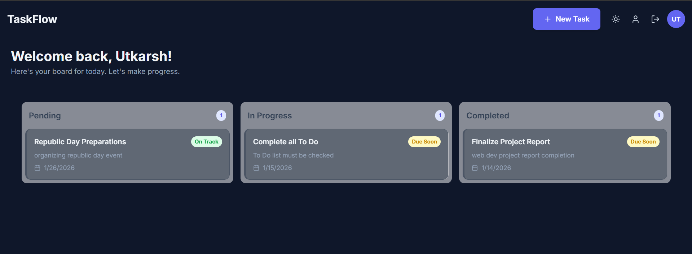

# TaskFlow: A Modern Full-Stack Task Management Application

<div align="center">

**A feature-rich, SaaS-grade Kanban board application built to demonstrate professional, end-to-end web development. From a secure, validated backend API to a fluid, animated, and visually stunning user interface with light and dark modes.**

</div>

<br />

<div align="center">

[](https://utkarshtaskflow.vercel.app/)
[](https://reactjs.org/)
[](https://nodejs.org/)
[](https://www.typescriptlang.org/)
[](https://tailwindcss.com/)

</div>

<br />

<div align="center">


*(A short demo showcasing the application's features, including dark mode, animations, and drag-and-drop.)*

</div>

## ✨ Features

This project goes beyond a simple CRUD application to deliver a complete, polished user experience.

-   **Modern Authentication & User Management:**
    -   Seamless, modal-based **Sign Up** and **Login** flow.
    -   Secure, JWT-based session management.
    -   Users can **update their profile** information.
    -   Users can securely **delete their account**, which also removes all associated data.
    -   Strong password validation on the backend using Zod.

-   **Intelligent Kanban Board:**
    -   Full **CRUD** functionality for tasks (Create, Read, Update, Delete).
    -   **Smart Due-Date Intelligence:** Tasks are automatically badged as `🔴 Overdue`, `🟠 Due Soon`, or `🟢 On Track`.
    -   Fluid **drag-and-drop** for reordering tasks and changing their status.
    -   Task counts in each column header for an at-a-glance overview.

-   **Professional UI/UX & Visuals:**
    -   **Light & Dark Mode:** A beautiful, persistent, and toggleable dark mode for user comfort.
    -   **Fluid Animations:** Built with `framer-motion` for staggered loading animations, smooth modal transitions, and a delightful user experience.
    -   **SaaS-Grade Landing Page:** A visually engaging homepage with a gradient hero, feature sections, and modern design patterns.
    -   **Toast Notifications:** Non-intrusive, real-time feedback for all user actions (e.g., "Task created," "Profile updated").
    -   **Glassmorphism & Animated Backgrounds:** A subtle, animated gradient background and frosted-glass effects create a sense of depth and polish.
    -   **Skeleton Loaders & Empty States:** Ensures a smooth experience even with network latency or no data.
    -   **Fully Responsive Design:** A seamless experience on any device, from desktop to mobile.

-   **Robust & Secure Backend:**
    -   A clean, RESTful API built with Node.js, Express, and TypeScript.
    -   **Input Validation:** All incoming data is validated using Zod to ensure data integrity and security.
    -   **Centralized Error Handling:** A global error middleware provides consistent and meaningful error responses.
    -   **User-Specific Data:** API logic ensures users can only access and modify their own tasks.

## 🛠️ Tech Stack

This project leverages a modern, industry-standard tech stack chosen to build a scalable and maintainable application.

### Backend

| Tech         | Description                                   |
|--------------|-----------------------------------------------|
| **Node.js**  | JavaScript Runtime Environment                |
| **Express**  | Web framework for building the RESTful API    |
| **TypeScript** | Statically typed language for robust code     |
| **MongoDB**    | NoSQL database for flexible data storage      |
| **Mongoose**   | Object Data Modeling (ODM) for MongoDB        |
| **JWT**        | Secure, token-based user authentication       |
| **Zod**        | TypeScript-first schema validation          |
| **bcrypt**     | Library for securely hashing passwords        |

### Frontend

| Tech               | Description                                       |
|--------------------|---------------------------------------------------|
| **React**          | Library for building dynamic user interfaces      |
| **Vite**           | Next-generation frontend build tool               |
| **TypeScript**     | Statically typed language for component safety    |
| **Tailwind CSS**   | Utility-first CSS framework for rapid UI development |
| **Framer Motion**  | Production-ready library for fluid animations     |
| **dnd-kit**        | Modern, lightweight drag-and-drop toolkit         |
| **Axios**          | Promise-based HTTP client for API communication   |
| **React Hot Toast**| Library for elegant, non-intrusive notifications  |

## 🚀 Getting Started

Follow these instructions to get a copy of the project up and running on your local machine.

### Prerequisites

-   Node.js (v18 or later)
-   npm (or a compatible package manager)
-   A MongoDB database instance (you can get a free one from [MongoDB Atlas](https://www.mongodb.com/cloud/atlas))

### 1. Backend Setup

First, set up and run the backend server.

```bash
# 1. Navigate to the backend directory
cd backend

# 2. Install dependencies
npm install

# 3. Create the environment file by copying the example
cp .env.example .env
```

Next, open the newly created `.env` file and fill in your environment variables.

```env
PORT=5000
MONGO_URI="mongodb+srv://<user>:<password>@<cluster-url>/<database-name>?retryWrites=true&w=majority"
JWT_SECRET="your-super-secret-jwt-key-goes-here"
```

Finally, run the backend development server:

```bash
# Run the server (it will auto-restart on changes)
npm run dev
```

The backend API will be running on `http://localhost:5000`.

### 2. Frontend Setup

In a **new terminal window**, set up and run the frontend application.

```bash
# 1. Navigate to the frontend directory
cd frontend

# 2. Install dependencies
npm install

# 3. Run the frontend development server
npm run dev
```

The frontend application will be running and accessible at `http://localhost:5173`.

## 📝 API Endpoints Overview

All routes under `/api/users` and `/api/tasks` are protected and require a valid JWT `Bearer` token in the `Authorization` header.

| Method   | Endpoint             | Description                                      |
|----------|----------------------|--------------------------------------------------|
| `POST`   | `/api/auth/register` | Register a new user.                             |
| `POST`   | `/api/auth/login`    | Log in a user and receive a JWT token.           |
| `GET`    | `/api/users/me`      | Get the current user's profile information.      |
| `PUT`    | `/api/users/me`      | Update the current user's name.                  |
| `DELETE` | `/api/users/me`      | Delete the current user and all their data.      |
| `POST`   | `/api/tasks`         | Create a new task.                               |
| `GET`    | `/api/tasks`         | Get all tasks for the logged-in user.            |
| `PUT`    | `/api/tasks/:id`     | Update a specific task (title, status, etc.).    |
| `DELETE` | `/api/tasks/:id`     | Delete a specific task.                          |
